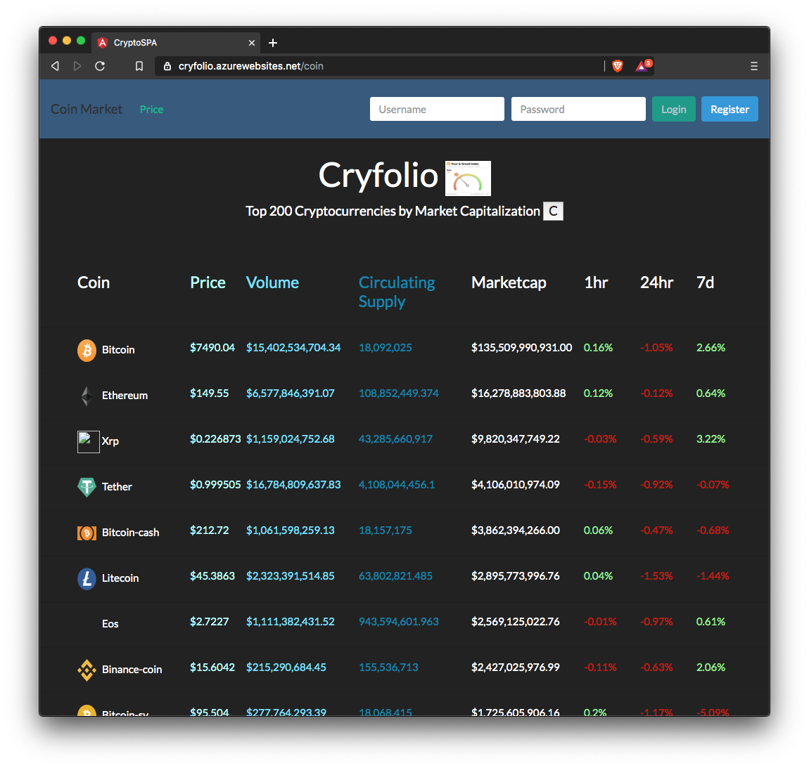
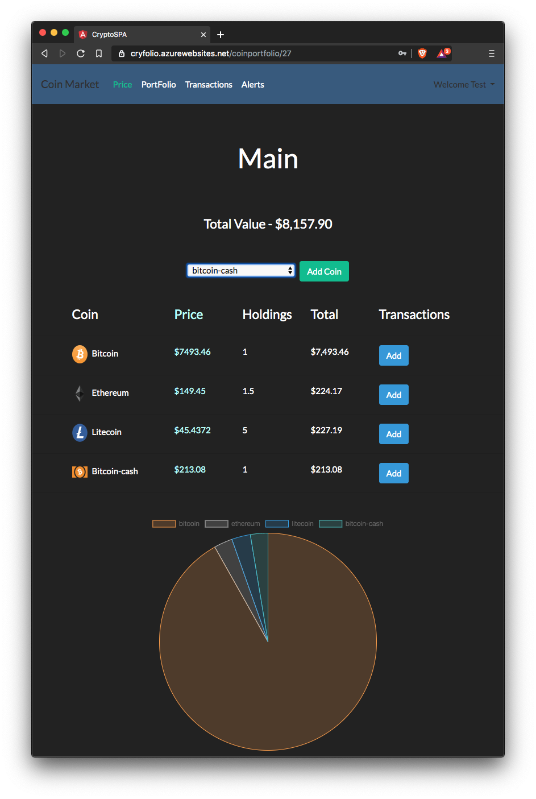
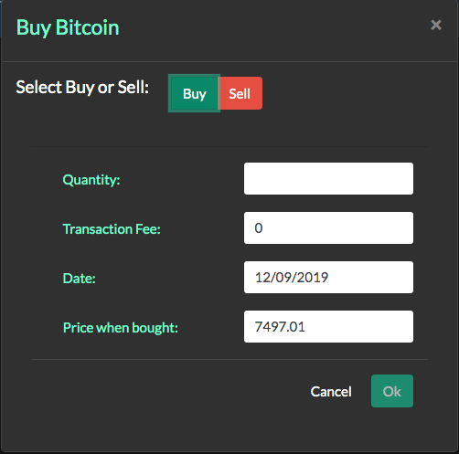

# CryptoPortfolio
Crypto Currency Portfolio Tracker made in .Net Core and Angular 8

Test Project I created to learn .Net Core web API and Angular 8.

  <b> Main View </b>
  
  <b> Portfolio View </b> 
   
  <b> Add Transaction </b> 
  

FEATURES
--------

* view top 200 Cryptocurrencies
* changes in value over 1hr, 24hr, 7 days
* view on different screen sizes mobile/desktop (Bootstrap)
* Auto Refreshes the price every 2 minutes
* Register new user
* Login/Logout
* Create new portfolio
* View portfolio
* Add coin to portfolio
* Add new buy/sell transaction
* View pie chart of current portfolio
* View total amount of all portfolios
* View Total amount and value of all coins in all portfolios
* included fear and greed index from https://alternative.me/crypto/fear-and-greed-index

Soon to be included..
* View transactions by portfolio/coin
* Alerts for price notifications

I get the price data from - https://coinmarketcap.com/api/

.Net Core web API
-----------------

* gets prices every two minutes from api
* Handles user register and logon using salt and hashing
* Entity framework for db storing users portfolios coins and transactions

Don't store any real cryptocurrency portfolios on this site!. - https://cryfolio.azurewebsites.net/
